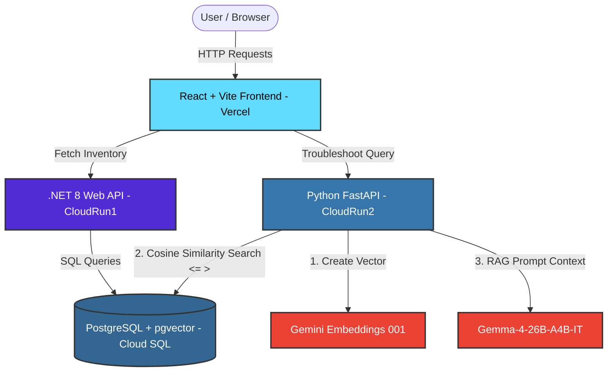

# 🏗️ Y&Y App – AI-Powered Industrial ERP 

[](https://yny-ui.vercel.app/)
[](https://www.youtube.com/watch?v=JHX0fRmJuW4)

> An industrial-grade, microservices-based SaaS that combines live ERP inventory management with a state-of-the-art **AI Domain-Expert Agent** capable of diagnosing machinery issues in real-time.

Building monolithic apps is a thing of the past. Y&Y App showcases a robust, strictly decoupled **Microservices Architecture**, separating enterprise business logic (inventory) from complex AI workflows (Retrieval-Augmented Generation), all unified under a blazing-fast React frontend.

## ✨ The Elevator Pitch

Don't just track your equipment—*troubleshoot it*. Y&Y App uses a **Retrieval-Augmented Generation (RAG)** pipeline powered by Google's Gemini APIs and PostgreSQL `pgvector`. When a user reports a strange noise from a pump, the AI doesn't guess; it performs a vector similarity search to retrieve the exact manufacturer maintenance manual and synthesizes a safe, factual resolution.

## 🚀 Key Features

*   **Microservices Architecture:** Independent scaling for UI, ERP, and AI logic.
*   **Enterprise-Grade ERP API:** Built with **.NET 8 Minimal APIs** for extreme performance and type-safe data handling.
*   **AI RAG Pipeline:** A **Python FastAPI** service utilizing `gemini-embedding-001` and the ultra-low latency `gemma-4-26b-a4b-it` Mixture-of-Experts (MoE) model.
*   **Unified Vector Database:** **Google Cloud SQL (PostgreSQL)** handles standard relational data *and* 768-dimensional mathematical vector embeddings in the same place via the `pgvector` extension.
*   **Serverless Deployment:** APIs deployed on **Google Cloud Run** (scales to zero) and frontend hosted on **Vercel**.


## 🏗️ Architecture & Data Flow



## 🛠️ Tech Stack

| Tier            | Technology              | Why we chose it                                              |
| :-------------- | :---------------------- | :----------------------------------------------------------- |
| **Frontend**    | React + Vite            | Fast compilation, modern hooks-based UI, easily deployed to Vercel. |
| **Logic (ERP)** | .NET 8 (C#)             | Industry standard for secure, highly structured, and fast enterprise business data. |
| **Logic (AI)**  | Python + FastAPI        | The undisputed ecosystem for AI/ML integration and data processing. |
| **Database**    | PostgreSQL + `pgvector` | Eliminates the need for a separate Vector DB by handling both standard SQL and Cosine Distance (`<=>`) vector math natively. |
| **LLMs**        | Gemini API              | Gemma 4-26b MoE offers incredible intelligence with low inference latency, ideal for real-time agents. |
| **Cloud**       | Google Cloud Platform   | Seamless integration via Cloud Run and Cloud SQL over secure Unix domain sockets. |


## 💻 Local Development Setup

Want to run this monorepo locally? Follow these steps:

### 1. Database Configuration

Ensure you have a PostgreSQL instance running with the `pgvector` extension enabled.

1. Run the initial SQL script located in the tutorial to create the `Products` and `manual_knowledge` tables.
2. Insert the seed ERP data.

### 2. Run the ERP API (.NET)

```bash
cd yny.Api
# Update connection string in appsettings.json with your DB credentials
dotnet restore
dotnet run
```

*API will be live at `http://localhost:5000`*

### 3. Run the AI Agent (Python)

```bash
cd yny.AI
python3 -m venv venv
source venv/bin/activate  # On Windows: venv\Scripts\activate
pip install -r requirements.txt

# Create a .env file with DB_URL and GEMINI_API_KEY
# Run the seed script to inject vector knowledge
python seed.py

# Start the API
python main.py
```

*API will be live at `http://localhost:8080`*

### 4. Run the Dashboard (React)

```bash
cd yny-ui
npm install
# Ensure .env connects to your local .NET and Python ports
npm run dev
```

*App will be live at `http://localhost:5173`*


## 🌐 Cloud Deployment

This application is fully containerized with `Docker` and designed for serverless architectures:

- **Backend Services:** Deployed via **Google Cloud Run**, utilizing secure Unix Domain Sockets for database connections without exposing TCP ports. Auto-deploys via GitHub Actions CI/CD.
- **Frontend UI:** Auto-deployed globally via **Vercel**.

## 🤝 Contributing

Contributions, issues, and feature requests are welcome! Feel free to check the [issues page](../../issues).

## 📝 License

This project is [MIT](https://choosealicense.com/licenses/mit/) licensed.

