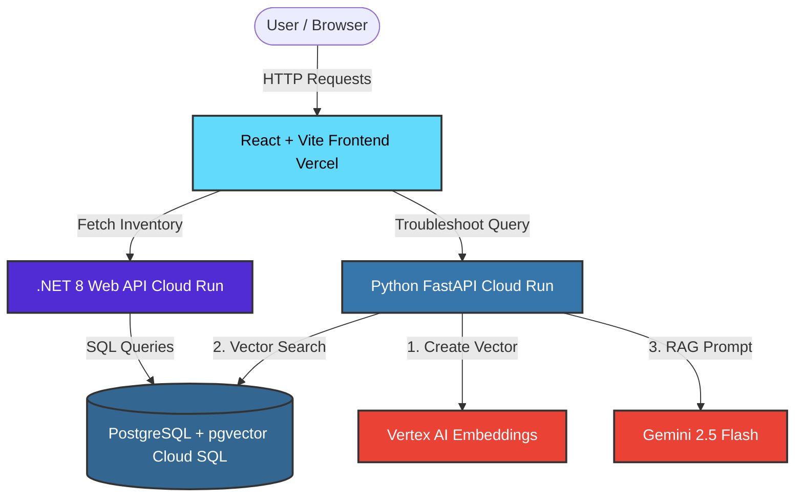

# 🏭 Y&Y App: AI-Powered Domain-Expert ERP System

[](https://yny-ui.vercel.app/)
[](https://www.youtube.com/watch?v=JHX0fRmJuW4)

An industrial-grade, microservices-based SaaS prototype that integrates secure ERP inventory management with a specialized AI troubleshooting agent using **Retrieval-Augmented Generation (RAG)**.

## 🌟 Project Overview

Industrial maintenance requires immediate, accurate access to complex technical manuals. **Y&Y App (yny)** bridges the gap between structured business data and unstructured technical knowledge. 

Instead of a monolithic architecture, this project utilizes a strict **Microservices Architecture** to ensure data integrity, separating standard ERP logic from AI processing. 

### Key Features

1. **Live ERP Dashboard:** Real-time inventory tracking powered by a lightning-fast .NET 8 backend.
2. **AI Domain-Expert Agent:** An AI troubleshooter that converts user queries into mathematical vectors, searches through technical manuals via `pgvector`, and synthesizes professional engineering resolutions using **Gemini 2.5 Flash**.
3. **Serverless Scale-to-Zero:** Backend services are containerized and deployed on Google Cloud Run to keep infrastructure costs minimal while allowing infinite scalability.


## 🏗️ Architecture & Tech Stack



* **Data Tier:** Google Cloud SQL (PostgreSQL) + `pgvector` extension.
* **Logic Tier (ERP):** .NET 8 Web API (C#) using Minimal APIs and Entity Framework Core.
* **Logic Tier (AI):** Python + FastAPI powered by Google Vertex AI (`text-embeddings-004` & `gemini-2.5-flash`).
* **Presentation Tier:** React + Vite.
* **Infrastructure:** Google Cloud Run (Backend Containers), Vercel (Frontend), GitHub Actions (CI/CD).


## 📂 Repository Structure

```text
/yny-app
  ├── /yny.Api      # .NET 8 Backend (ERP Inventory Data)
  ├── /yny.AI       # Python FastAPI (RAG pipeline & LLM Integration)
  └── /yny-ui       # React + Vite (Frontend Dashboard)
```


## 🚀 Getting Started (Local Development)

To run this application locally, you will need **.NET 8 SDK**, **Python 3.10+**, **Node.js**, and a **PostgreSQL** instance with the `pgvector` extension installed.

### 1. Database Setup

Create a PostgreSQL database and run the initial setup script:

```sql
CREATE EXTENSION IF NOT EXISTS vector;
-- (See full SQL schema in the tutorial/docs to build tables and seed ERP data)
```

### 2. Start the ERP API (.NET)

Update your connection string in `yny.Api/appsettings.json`, then run:

```bash
cd yny.Api
dotnet restore
dotnet run
```

*API will run on `http://localhost:5000` (or similar).*

### 3. Start the AI API (Python)

You need a Google Cloud Project with Vertex AI enabled. Configure your `.env` file inside `yny.AI/` with your `GCP_PROJECT_ID`, `GCP_LOCATION`, and `DB_URL`.

```bash
cd yny.AI
python -m venv venv
source venv/bin/activate  # (Windows: venv\Scripts\activate)
pip install -r requirements.txt

# Seed the AI database with the manual first:
python seed.py

# Start the server:
uvicorn main:app --reload --port 8080
```

*AI service will run on `http://localhost:8080`.*

### 4. Start the Frontend (React)

Set your `.env` variables inside `yny-ui/` to point to your local APIs:

```env
VITE_ERP_API=http://localhost:5000
VITE_AI_API=http://localhost:8080
```

Then run the app:

```bash
cd yny-ui
npm install
npm run dev
```


## 🧪 Demo Workflow

To verify the system's end-to-end functionality once running:

1. Open the **React Dashboard** to view the live inventory populating from the .NET backend.
2. Note the target equipment: `PUMP-CENT-001`.
3. Input a specialized query into the AI module: *"Why is the pump making a crackling noise like gravel?"*
4. Click **Consult AI**. The Python service will vectorize the query, perform a Cosine Distance search on the `pgvector` database, retrieve the seeded manual, and synthesize a resolution using Gemini.


## ☁️ Deployment

This project is built to be deployed using **Docker containers** and **Serverless** technologies.

* **Backend:** Contains `Dockerfile`s in both API directories, designed for zero-config deployment to **Google Cloud Run**.
* **Frontend:** Optimized for one-click deployment via **Vercel**.
* **CI/CD:** Check the `.github/workflows` folder (if implemented) for automated deployment pipelines using GitHub Actions.


## 📄 License

This project is licensed under the MIT License.

